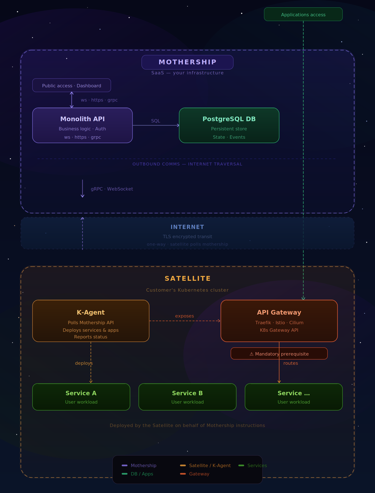

# How to create a Kubernetes Datacenter ?

This is the first K-Agent Odin is bringing as a the almost every application can be deployed in a Kubernetes Cluster.





## How to deploy and enroll a new Kubernetes Agent ? 

The deployment is done in two steps :
- First you register it and get the dedicated UUID (needed for encryption)
- Second, get the `MOTHERSHIP_AUTH_TOKEN` in the mothership api logs and put it in the agent **.env**.
- Then you can launch it with the `AGENT_UUID` environment variable that will reach the `MOTHERSHIP_URL`.

### 1. Record and get UUID

In the first launch, **do not set** the `AGENT_UUID` variable but set the proper `MOTHERSHIP_URL` & `AGENT_LABEL`.

The agent will reach the `/agent/register` to register himself in the mothership.

### 2. Launch the agent

Now that you have the UUID, you can set the `AGENT_UUID` / `MOTHERSHIP_URL` and launch the agent again. It will now trigger the every 5 sec to tell its status and get the wanted applications state.

From now on, it will reach the `/agent/up` to get the wanted state of deployments. It also gives its own state (and applications states).

### 3. Attribution to datacenter

In order to the agent to work, you'll need to attribute it to a new Datacenter.

So you should execute this command : 
```
read -p 'MOTHERSHIP_URL : ' MOTHERSHIP_URL
read -p 'DATACENTER_ID : ' DATACENTER_ID
read -p 'AGENT_UUID : ' AGENT_UUID
read -p 'USER_TOKEN : ' USER_TOKEN

curl --request POST \
  --url https://$MOTHERSHIP_URL/datacenter/$DATACENTER_ID/agent/$AGENT_UUID \
  --header 'Authorization: Bearer $USER_TOKEN' 
```